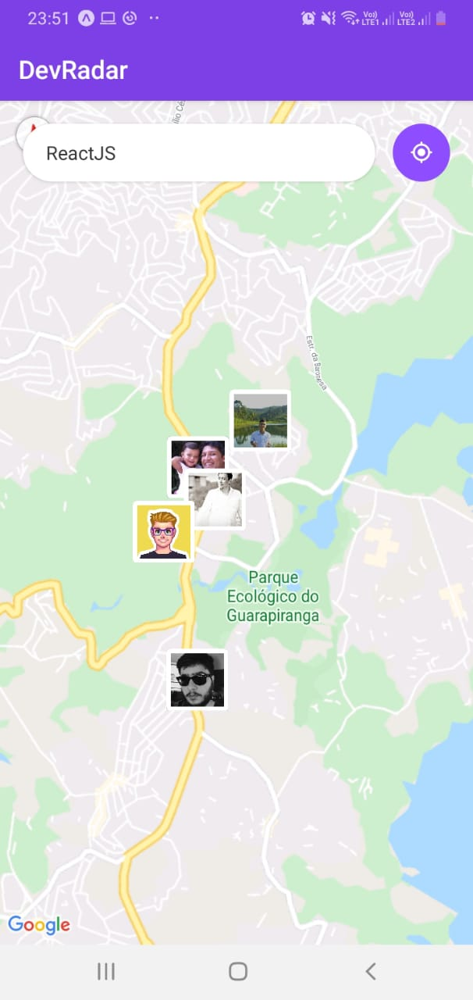
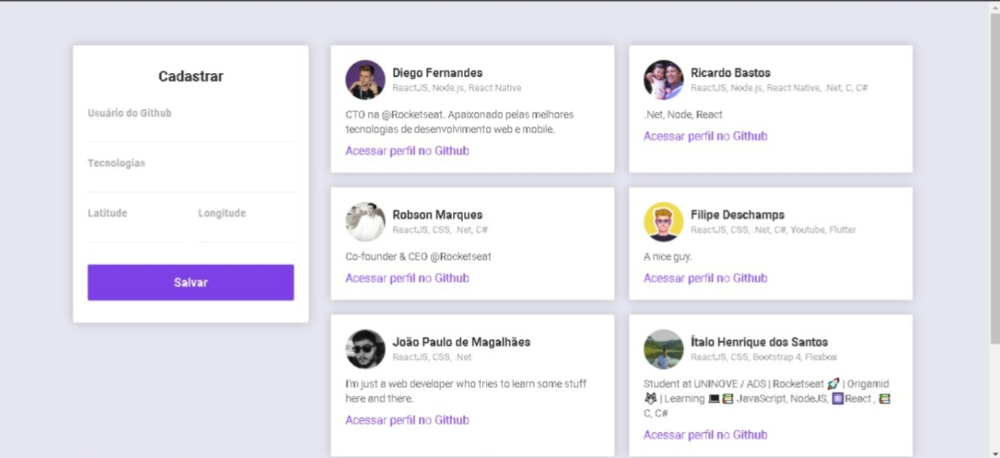

<h1 align="center">
    
</h1>

<h2 align="center">
  🚀 Semana OmniStack 10.0
</h2>

  <a href="#rocket-tecnologias">Tecnologias</a>&nbsp;&nbsp;&nbsp;|&nbsp;&nbsp;&nbsp;
  <a href="#-projeto">Projeto</a>&nbsp;&nbsp;&nbsp;&nbsp;&nbsp;&nbsp;

 

  
  

## 👨🏼‍💻 Desenvolvedor 

- [Ítalo Henrique](https://www.linkedin.com/in/italo-tech/)

## :rocket: Tecnologias

Esse projeto foi desenvolvido com as seguintes tecnologias:

- [Node.js](https://nodejs.org/en/)
- [React](https://reactjs.org)
- [React Native](https://facebook.github.io/react-native/)
- [Expo](https://expo.io/)

## 💻 Projeto

O DevRadar é um projeto que visa conectar desenvolvedores próximos a você que trabalham com as mesmas tecnologias.

## Passos para utilizar 
1. Faça um clone desse repositório;
2. Entre na pasta `cd devradar`;

## Backend
1. Entre na pasta `cd backend`;
2. Rode `yarn` para instalar as dependências;
3. Rode `yarn dev` para iniciar o servidor.

## Frontend 
1. Entre na pasta frontend
2. Rode `yarn` para instalar as dependências;
3. Rode `yarn start` para iniciar a aplicação;
